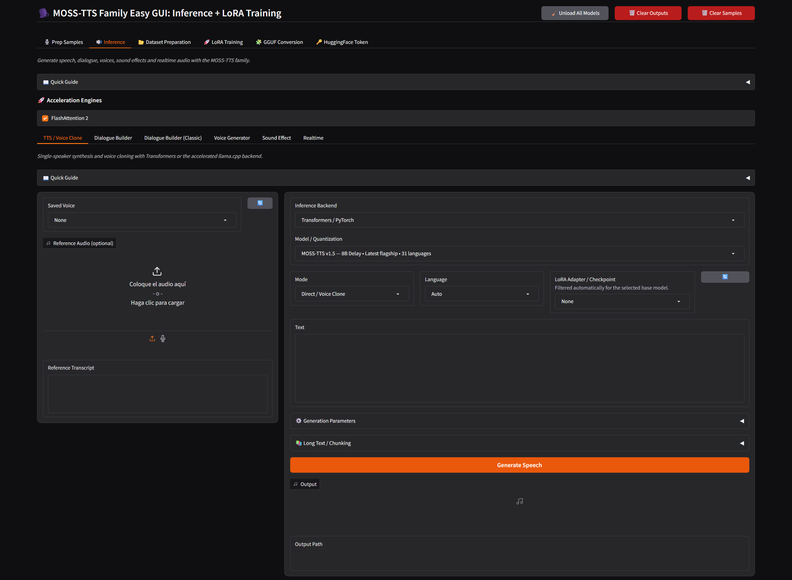

# 🗣️ MOSS-TTS Family Easy GUI: Inference + LoRA Training

A Windows WebUI for the **OpenMOSS MOSS-TTS family**, combining voice cloning, multi-speaker generation, long-form synthesis, reusable voice libraries, dataset preparation, LoRA training, and an accelerated llama.cpp CUDA backend.



---

## ✨ Feature Overview

| Area | What it does |
| :--- | :--- |
| **MOSS-TTS Inference** | Run the MOSS-TTS speech models locally with voice cloning and multilingual generation. |
| **llama.cpp CUDA** | Fast GGUF inference with selectable quantization and VRAM presets. |
| **Voice Library** | Save and reuse reference voices and transcripts across the GUI. |
| **Long-Form Generation** | Automatically split long text and join the generated clips with configurable silence. |
| **Dialogue Builder** | Create native multi-speaker MOSS-TTSD conversations. |
| **Dialogue Builder Classic** | Build unrestricted turn-by-turn conversations with regular MOSS-TTS voices. |
| **Voice Generator** | Design voices from natural-language descriptions. |
| **Sound Effect** | Generate sound effects with the MOSS-SoundEffect family. |
| **Realtime TTS** | Access the low-latency MOSS-TTS Realtime model. |
| **Dataset Preparation** | Create and manage reusable training projects from local audio and transcripts. |
| **LoRA Training** | Train, resume, checkpoint, evaluate, and monitor MOSS-TTS LoRAs locally. |
| **LoRA → GGUF** | Convert trained LoRA checkpoints for use with the llama.cpp backend. |

---

## 🧠 Included Models

### Speech Synthesis

| Model | Size | Use |
| :--- | :---: | :--- |
| **MOSS-TTS v1.5** | 8B | Main current voice-cloning and speech-generation model. |
| **MOSS-TTS v1.0** | 8B | Previous-generation MOSS-TTS model. |
| **MOSS-TTS Local v1.5** | 4B | Newer Local Transformer model. |
| **MOSS-TTS Local v1.0** | 1.7B | Lightweight Local Transformer model. |

### MOSS Family

- **MOSS-TTSD v1.0** — native 1–5 speaker dialogue generation.
- **MOSS-VoiceGenerator** — instruction-driven voice design.
- **MOSS-SoundEffect** — autoregressive sound generation.
- **MOSS-SoundEffect v2.0** — newer text-to-audio generation.
- **MOSS-TTS Realtime** — low-latency multilingual speech synthesis.

Models are downloaded when needed and reused on later launches.

---

## 🛠️ Requirements

| Requirement | Recommended |
| :--- | :--- |
| **OS** | Windows 10/11 x64 |
| **RAM** | 32 GB+ |
| **GPU** | NVIDIA CUDA GPU |
| **VRAM** | 12 GB+ for supported inference configurations |
| **LoRA Training** | 24 GB+ VRAM recommended |

---

## 📦 Installation

Run:

```bat
1- install.bat
```

The installer creates the project-local environment and installs the required dependencies.

Model files are downloaded separately when they are first needed.

---

## ▶️ Launch

Run:

```bat
2- run.bat
```

The GUI opens locally at:

```text
http://127.0.0.1:7860
```

---

## 🎙️ Voice Library

The **Prep Samples** tab creates reusable reference voices for inference and dialogue generation.

You can:

- load and preview reference audio;
- trim samples before saving;
- store the matching transcript;
- reuse voices throughout the application;
- refresh voice selectors without restarting the GUI;
- delete saved entries.

The library supports the compatible `.txt` and `.json` voice metadata formats used by the Easy GUI workflow, making existing voice libraries easier to move between projects.

Saved voices are stored under:

```text
voices/
```

---

## 🗣️ TTS / Voice Clone

The main inference tab provides regular MOSS-TTS generation and voice cloning.

Choose:

- inference backend;
- model;
- language;
- saved voice or reference audio;
- optional LoRA adapter;
- generation settings.

Generated audio is saved under:

```text
outputs/
```

### Transformers Backend

The Transformers backend provides the full supported MOSS-TTS workflow, including features that are not available through the GGUF runtime.

### llama.cpp CUDA Backend

The bundled **llama.cpp CUDA** backend provides substantially faster GGUF inference on supported NVIDIA GPUs.

When selected, the GUI exposes its own:

- model quantization;
- VRAM preset;
- GPU layer controls;
- KV cache options;
- Flash Attention option;
- CPU/GPU component placement controls;
- compatible converted LoRA adapters.

Presets are provided for **8 GB, 12 GB, 16 GB, and 24 GB VRAM** configurations.

The required Windows llama.cpp runtime is already bundled with the project. End users do not need to compile it.

### GGUF Quantizations

Different quantizations are stored as separate model files. Selecting a quantization that has not been prepared yet may require an additional one-time model preparation/download before inference.

Once available locally, it is reused automatically.

---

## 📖 Long-Form Generation

Long-form generation can split large text into smaller synthesis passes using practical text boundaries and then assemble the results automatically.

A configurable silence control determines the gap between generated clips.

This is recommended for narration, articles, scripts, and other text that is too long for a single generation.

---

## 👥 Dialogue Builder

The native **Dialogue Builder** uses MOSS-TTSD for multi-speaker conversations.

It supports **1 to 5 speakers**, with saved Voice Library entries carrying the reference voice and its transcript together.

Turns can be added, cloned, removed, and reordered before generation.

---

## 💬 Dialogue Builder Classic

**Dialogue Builder Classic** generates each turn with the regular MOSS-TTS pipeline and then joins the results.

Each row has its own:

- voice;
- text;
- generation context.

Unlike native MOSS-TTSD, Classic is not limited to five speakers.

The pause between turns is configurable in seconds.

---

## 🎨 Voice Generator

**MOSS-VoiceGenerator** creates voices from written descriptions.

Instructions can describe characteristics such as:

- timbre;
- age or gender impression;
- accent;
- emotion;
- speaking speed;
- pitch;
- articulation.

---

## 🔊 Sound Effect

The GUI includes both generations of the MOSS-SoundEffect family.

**MOSS-SoundEffect v2.0** provides its dedicated generation controls, including duration, inference steps, CFG, sigma shift, and seed.

Its environment is managed automatically by the application.

---

## ⚡ Realtime TTS

**MOSS-TTS Realtime** provides the low-latency speech-generation workflow and its supported language selector.

The GUI includes the multilingual options exposed by the released model, plus automatic language selection where applicable.

---

## 📚 Dataset Preparation

Dataset projects keep the source folder, prepared data, and project settings together so work can be resumed later.

A simple dataset can use matching audio and transcript filenames:

```text
dataset/
├── 000001.wav
├── 000001.txt
├── 000002.wav
├── 000002.txt
└── ...
```

The GUI can browse directly from the selected **Source Audio Folder**, edit project metadata, prepare the dataset, and restore saved project fields when a project is selected again.

---

## 🧬 LoRA Training

The **LoRA Training** tab provides project-based single-GPU training for supported MOSS-TTS models.

It includes:

- VRAM-aware **AutoTune**;
- editable training hyperparameters;
- wide ranges for small and large datasets;
- checkpoint saving by steps or epochs;
- resume-from-checkpoint selection;
- generated evaluation audio;
- TensorBoard logging;
- automatic project restoration.

AutoTune uses the selected model, available VRAM, dataset size, and training duration to provide a practical starting configuration. All important values remain editable.

Training outputs are stored under:

```text
training/outputs/
```

---

## 📊 TensorBoard & Evaluation Audio

Training runs can be monitored with TensorBoard directly from the GUI.

Saved checkpoints can also produce evaluation audio, making it easier to compare voice similarity and training progress without waiting for the final adapter.

---

## 🔄 LoRA → GGUF Conversion

The dedicated **GGUF Conversion** tab converts trained LoRA checkpoints for the llama.cpp backend.

Select:

1. a trained project or checkpoint;
2. the checkpoint to convert;
3. a custom output name.

Converted adapters then appear automatically in the compatible **LoRA Adapter** selector when llama.cpp is selected for inference.

This conversion is only for LoRA adapters. Normal llama.cpp model setup remains automatic from the inference workflow.

---

## 🔑 Hugging Face Token

Some OpenMOSS model repositories require accepting their Hugging Face terms before downloading.

The **Hugging Face Token** tab provides instructions and a field for saving the token used by the application.

Typical setup:

1. Create or sign in to a Hugging Face account.
2. Accept the access conditions on the required OpenMOSS model page.
3. Create a Hugging Face access token.
4. Paste it into the GUI.
5. Save it and retry the model download.

The token is used only for authenticated Hugging Face downloads required by the application.

---

## 📁 Project Folders

| Folder | Purpose |
| :--- | :--- |
| `.runtime/` | Bundled/local application runtimes. |
| `models/` | Downloaded and prepared model files. |
| `outputs/` | Generated audio. |
| `voices/` | Reusable reference voices and metadata. |
| `training/projects/` | Saved dataset and training projects. |
| `training/datasets/` | Prepared datasets. |
| `training/outputs/` | LoRA adapters, checkpoints, logs, and evaluation audio. |
| `moss_tts_upstream/` | Bundled OpenMOSS source used by the GUI. |

---

## 💡 Quick Guides

Every main workflow includes a compact **Quick Guide** near the top of its tab or sub-tab.

These guides explain the controls that matter for the current task, including model-specific behavior, downloads, training, GGUF quantizations, and backend differences.

For most users, the Quick Guides are the best place to start before changing advanced settings.

---

## 🙏 Credits

### CORE PROJECT

**OpenMOSS / MOSS-TTS Family**

Main MOSS-TTS models, inference pipelines, dialogue, realtime speech, voice generation, sound generation, training foundations, and llama.cpp integration.

GitHub: https://github.com/OpenMOSS/MOSS-TTS  
Hugging Face: https://huggingface.co/OpenMOSS-Team  
License: Apache-2.0 / respective model licenses


### LLAMA.CPP

**OpenMOSS llama.cpp**

MOSS-specific GGUF and CUDA inference backend.

GitHub: https://github.com/OpenMOSS/llama.cpp


### WINDOWS ACCELERATION

**Triton for Windows**

Windows-compatible Triton runtime.

GitHub: https://github.com/triton-lang/triton-windows  
Original Project: https://github.com/woct0rdho/triton-windows  
License: MIT


**FlashAttention**

Memory-efficient attention acceleration.

GitHub: https://github.com/Dao-AILab/flash-attention  
License: BSD-3-Clause


### SPEECH TRANSCRIPTION

**Faster-Whisper**

Local speech transcription components used by supported preparation workflows.

GitHub: https://github.com/SYSTRAN/faster-whisper  
License: MIT


### GUI & WORKFLOW INSPIRATION

**FranckyB / Voice Clone Studio**

Inspiration for reusable voice-library and local voice-cloning workflows.

GitHub: https://github.com/FranckyB/Voice-Clone-Studio


---

## 📄 License

MOSS-TTS, its model weights, and third-party components remain subject to their respective upstream licenses and terms.

See the bundled `MOSS_TTS_LICENSE` and upstream notices for the original project terms.

This Easy GUI does not replace or supersede any upstream license.
